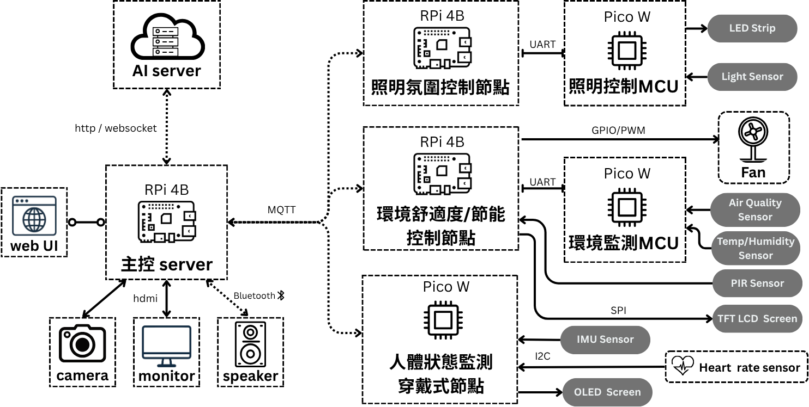

# Context-Aware Ambient System

這是一個以 Raspberry Pi、Pico W 組成的智慧空間情境感知與氛圍控制系統。

- `central-controller/`：主控 server、Dashboard、AI 情境感知、情境控制
- `subsystems/lighting/`：照明控制子系統，監測環境光以及控制空間照明
- `subsystems/environment/`：環境舒適度與節能控制子系統，監測空間環境數據(溫溼度、空氣品質、PIR等)，並控制風扇。
- `subsystems/wearable/`：穿戴式感測子系統，監測使用者的生理狀態(心律、血氧)及活動狀態。

## 系統架構

